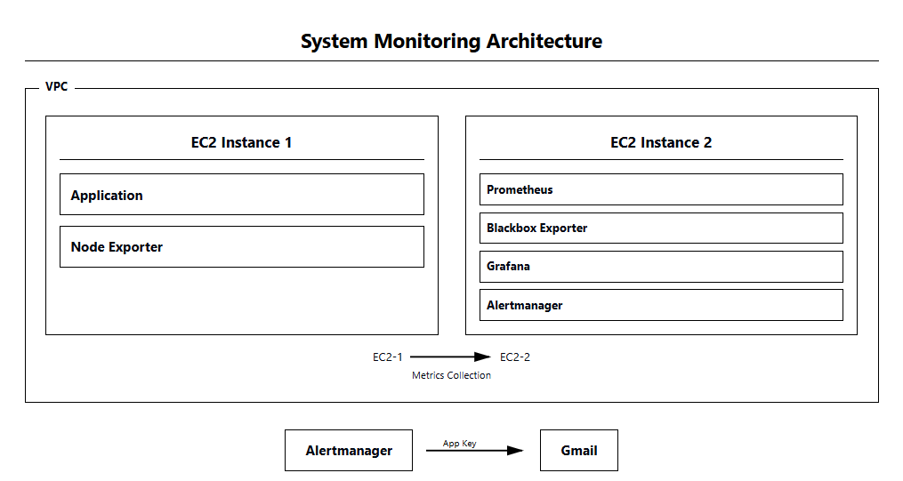
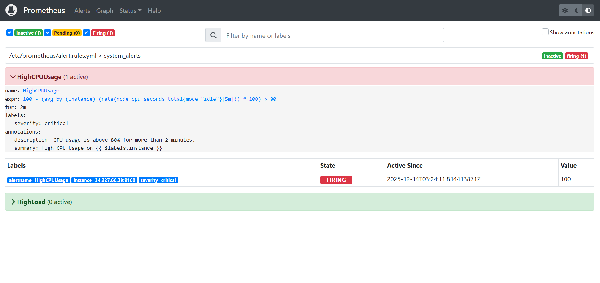
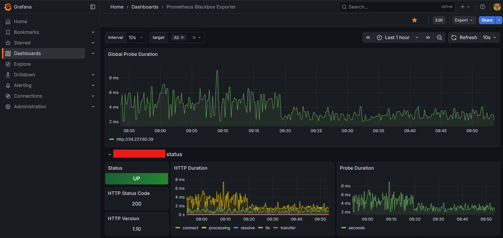
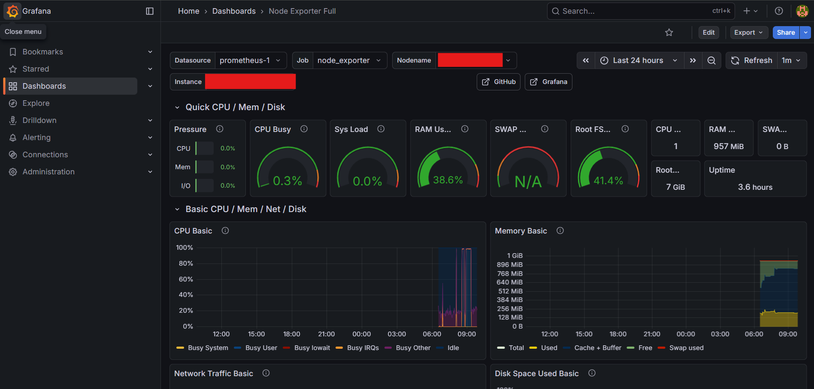
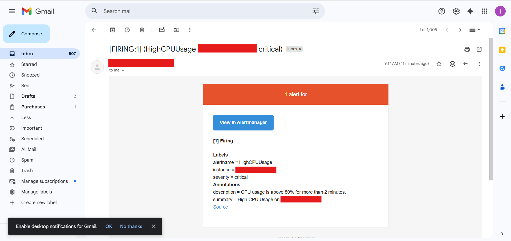

# AWS-based-Infrastructure-Monitoring-with-Prometheus-Grafana-and-Alertmanager
This project demonstrates an AWS-based monitoring setup using Prometheus, Grafana, Node Exporter, Blackbox Exporter, and Alertmanager. It enables real-time monitoring of system metrics, application availability, and automated email alerting, providing a practical foundation for DevOps and SRE practices.

## 1. Project Overview

This project demonstrates a **basic monitoring setup** using **Prometheus, Grafana, Node Exporter, Blackbox Exporter, and Alertmanager** on AWS EC2 instances.

Two EC2 servers were used:

* **Application Server (Production Server)** – Runs a sample web application and Node Exporter  
* **Monitoring Server** – Runs Prometheus, Grafana, Blackbox Exporter, and Alertmanager

**Goal:** Monitor **server health, application availability, system metrics, and trigger email alerts** in a simple yet industry-aligned setup.

---

## 2. Architecture Overview

### VPC Setup

* Both EC2 instances are deployed within the **same VPC and subnet**.  
* Security Groups allow monitoring traffic between servers while restricting public access.

### Architecture Flow

1. Node Exporter exposes system metrics from the Application Server.  
2. Blackbox Exporter probes application endpoints (HTTP checks).  
3. Prometheus scrapes metrics from both exporters.  
4. Alertmanager handles alerts triggered by Prometheus.  
5. Grafana visualizes metrics using dashboards.

**Architecture Diagram Placeholder:**  

---

## 3. Technologies Used

* AWS EC2 (Linux)  
* Prometheus  
* Grafana  
* Node Exporter  
* Blackbox Exporter  
* Alertmanager  
* Sample Web Application [GitHub Link](https://github.com/Isuru-Pavithra-Hapuarachchi/anon-feedback-webapp)

---

## 4. Application Server Configuration

### 4.1 Node Exporter Installation

Node Exporter was installed on the application server to collect system-level metrics:

* CPU usage  
* Memory usage  
* Disk usage  
* Network statistics

**Reference:** [Node Exporter Installation Guide](https://medium.com/@abdullah.eid.2604/node-exporter-installation-on-linux-ubuntu-8203d033f69c)

### 4.2 Port Configuration

* Node Exporter runs on port `9100`  
* Opened **only within the VPC subnet** using Security Groups

> Ensures internal monitoring without public exposure—best practice for production environments.

---

## 5. Monitoring Server Configuration

### 5.1 Prometheus Setup

Prometheus was installed and configured to:

* Scrape metrics from Node Exporter  
* Scrape probe results from Blackbox Exporter  
* Send alerts to Alertmanager

**Reference:** [Prometheus Installation Guide](https://www.cherryservers.com/blog/install-prometheus-ubuntu)

**Screenshot Placeholder:**  

### 5.2 Blackbox Exporter Setup

Blackbox Exporter was configured to:

* Monitor HTTP availability of the sample application  
* Measure response time and uptime

**Reference:** [Blackbox Exporter Guide](https://www.digital.khamlou.com/how-to-install-prometheus-blackbox-exporter-on-ubuntu-a-step-by-step-guide/)

**Screenshot Placeholder:**  

### 5.3 Grafana Setup

Grafana was installed and connected to Prometheus as a data source. Dashboards visualize:

* CPU, RAM, Disk usage (Node Exporter)  
* Server uptime  
* Application availability  
* HTTP response latency

**Reference:** [Grafana Installation Guide](https://www.cherryservers.com/blog/install-grafana-ubuntu-2404)

**Screenshot Placeholder:**  

### 5.4 Alertmanager Setup and Email Alerts

Alertmanager was installed and configured to **send email alerts** for critical events such as high CPU, low disk space, or application downtime.

* Alerts configured in Prometheus use rules like CPU > 80% for > 2 minutes.  
* Alertmanager handles routing and sends notifications via email.  

**Reference:** [Alertmanager Installation Guide](https://www.digital.khamlou.com/how-to-install-prometheus-alertmanager-on-ubuntu-server-step-by-step-guide/)

**Screenshot Placeholder:**  

## 6. Dashboards Implemented

### 6.1 System Metrics Dashboard

* CPU utilization  
* Memory consumption  
* Disk usage  
* Network traffic

### 6.2 Application Monitoring Dashboard

* HTTP status codes  
* Endpoint availability  
* Response time trends

---

## 7. Security Considerations

* Monitoring ports are restricted to the VPC subnet  
* No exporters are publicly exposed  
* Grafana access is protected via authentication

---

## 8. Project Outcome

This project successfully demonstrates:

* Basic DevOps monitoring principles  
* Use of Prometheus exporters for server and application monitoring  
* Dashboard creation using Grafana  
* Secure internal monitoring within AWS VPC

The setup follows **real-world monitoring practices** suitable for junior DevOps, SRE, or System Engineering roles.

---

## 9. Future Improvements

* Enable SSL certificate monitoring  
* Add log monitoring (ELK / Loki)  
* Monitor multiple application servers  

---

## 10. Conclusion

This monitoring project provides a clear understanding of how modern infrastructure monitoring is implemented using open-source tools. It serves as a strong foundation for learning **production-grade monitoring and observability concepts**.

---
